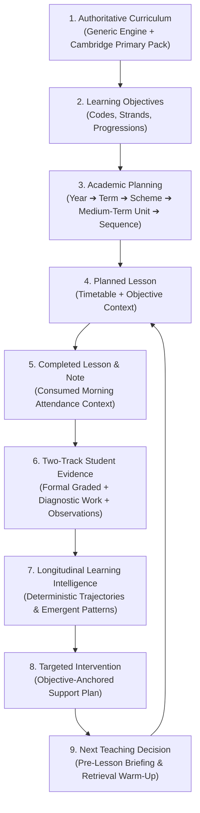
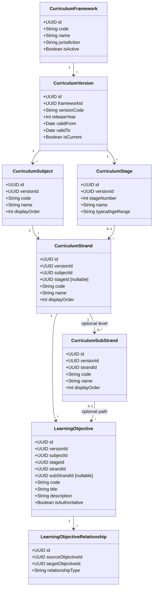
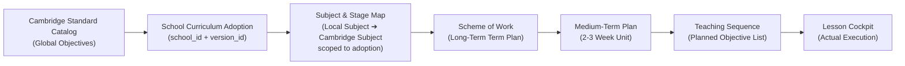
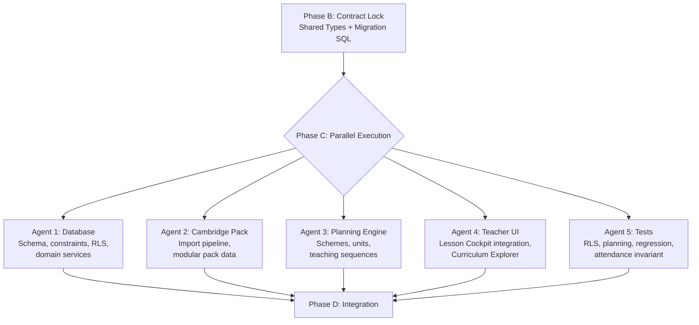

# SOMACAMPUS PHASE 6 ARCHITECTURE CONTRACT
## Curriculum Engine & Academic Planning (Cambridge Primary Implementation #1)

---

### Document Metadata
- **Status**: REVISION 2 — CORRECTIONS INCORPORATED, AWAITING FINAL APPROVAL
- **Phase**: Phase 6
- **Prerequisites**: Phase 1 (Teacher Day), Phase 2 (Lesson Cockpit), Phase 3 (Leadership Monitoring), Phase 4 (Learning Evidence Loop), Phase 5 (Learning Intelligence & Longitudinal Evidence) — All COMPLETE (`f7e458f`).
- **Target Repository**: `https://github.com/Jffkvn/somacampus`
- **Revision Notes**: Incorporates 8 architectural corrections from design review.

---

## 1. Executive Summary & Core Objective

The objective of Phase 6 is to transform SomaCampus into a **genuinely curriculum-aware institution platform**.

Phase 6 connects the entire educational lifecycle into an unbroken institutional loop:



### Two Deliverables

Phase 6 produces two distinct, simultaneous deliverables:

1. **The Platform: Generic Curriculum Engine**
   A curriculum-agnostic engine that can eventually support Cambridge Primary, Uganda NCDC, Kenya CBC, IB PYP, and any other structured curriculum framework — without schema changes.

2. **The Pilot: Cambridge Primary Implementation**
   A real, working implementation for the confirmed pilot school covering:
   - Mathematics
   - English
   - Science
   - Global Perspectives
   - Computing / Digital Literacy

**Acceptance criterion**: Can we sit with the school and demonstrate a real Cambridge subject moving from **curriculum objective → academic plan → planned lesson → teacher lesson → student evidence → learning intelligence**? If the answer is no, Phase 6 is not finished, regardless of how well the database is designed.

---

## 2. Invariant Architectural Guardrails

### A. Non-Negotiable Attendance Rule (Preserved)
- Student attendance is recorded **at class/stream level, once per morning** by the designated Class Teacher (or acting teacher).
- Attendance is **never recorded per lesson, per subject, or per timetable period**.
- The Lesson Cockpit strictly **consumes** the existing class morning attendance session status (`DailyAttendanceCoverage`).
- The Lesson Cockpit **does not contain any "Take Attendance" button** or secondary attendance modal.
- All 126 existing automated tests and attendance security constraints remain 100% green.
- Any agent that attempts to introduce per-lesson attendance is violating this contract.

### B. Generic Curriculum Engine vs. Cambridge Primary Pack #1
- **Platform Engine**: Agnostic of any specific national or international curriculum. Represents concepts: `Framework`, `Version`, `Subject`, `Stage`, `Strand`, `Sub-strand`, `Objective`, `Progression`.
- **Curriculum Pack**: Cambridge Primary is **Pack #1** loaded via an automated, validated data import pipeline.
- **Data-Driven Logic**: No hardcoded application code like `if (subject === 'Mathematics')`. All curriculum behavior, stages, strands, and progression logic are derived from data.
- **Future-Proof**: Supports future curriculum packs (e.g. Uganda NCDC, Kenya CBC, IB PYP) without schema changes.

### C. Cambridge Data Safety & Copyright Integrity
- **Zero Fabrication**: Under no circumstances will fake Cambridge learning objectives or fabricated wording be presented as official Cambridge curriculum.
- **Production Import Architecture**: Schema and import CLI/service are built to accept authoritative Cambridge curriculum JSON/CSV datasets.
- **Clear Provenance Flagging**: Any demonstration seed data provided for development is explicitly flagged (`is_authoritative: false`, `source: 'Demonstration Fixture'`).

### D. Historical Curriculum Version Safety
- Curriculum versions are historically immutable (`curriculum_versions`).
- Introducing a revised Cambridge syllabus (e.g., 2026 vs. 2024 revision) creates a new version record.
- Historical lessons, student submissions, teacher observations, and interventions remain permanently bound to the curriculum version under which they were taught.
- A new curriculum version must NOT silently mutate the meaning of historical evidence.

### E. Fault-Tolerant Teacher Workflow
- Academic planning **enriches**, but **never blocks**, lesson execution.
- If a school's scheme of work is incomplete, or a teacher teaches an impromptu topic, the teacher can still complete the lesson with a single click. The system falls back cleanly with `"Curriculum objective not yet assigned"` and provides a low-friction 2-tap picker.
- Incomplete planning must NEVER prevent normal lesson completion.

### F. Strict AI Advisory Boundaries (Preserved from Phase 5)
- No AI grading, no AI diagnosis, and no AI-certified mastery.
- All curriculum mapping, scheme progress tracking, and prerequisite lookups are **100% deterministic**.
- AI is strictly an optional assistive drafting layer (e.g., suggesting a 5-minute retrieval warm-up based on cited objective prerequisites).
- Curriculum objectives do not automatically become mastery scores.

### G. Evidence Is Not Mastery
- Having evidence for an objective means we **have evidence**. It does not mean the objective is mastered.
- Phase 6 does NOT create a competency or attainment model.
- The following terminology is **prohibited** in Phase 6 unless a formally defined competency model supports it:
  - ~~"mastery density"~~
  - ~~"mastery map"~~
  - ~~"objectives mastered"~~
- The following terminology is **acceptable**:
  - "objectives with evidence"
  - "objectives recently taught"
  - "objectives with recent learner evidence"
  - "objectives requiring further evidence"
  - "evidence coverage"
  - "observed pattern" / "possible pattern"
  - "teacher confirmed"

### H. Optional Curriculum Hierarchy Depth
- The generic engine must not force every curriculum into an identical hierarchy.
- Depending on authoritative curriculum data, a subject may use:
  - `Subject → Stage → Strand → Objective` (no sub-strands)
  - `Subject → Stage → Strand → Sub-strand → Objective` (with sub-strands)
- The data model must represent the **actual curriculum structure** for each subject.
- Do not fabricate hierarchy levels to fill the schema.
- The `sub_strand_id` on `learning_objectives` and the `sub_strands` table are explicitly optional.
- The import pipeline and UI must not assume every objective lives under a sub-strand.

---

## 3. Generic Curriculum Domain Model

### 3.1 Global Catalog vs. Tenant Adoption



> **Composite Version Enforcement**: Every entity in the hierarchy carries `version_id`. Composite foreign keys ensure that a strand's subject, a sub-strand's strand, and an objective's subject/stage/strand/sub-strand all provably belong to the **same curriculum version**. Cross-version references are impossible at the database level.

### 3.2 Canonical Database Schema (`supabase/migrations/20260910000000_phase6_curriculum_engine.sql`)

```sql
-- ============================================================
-- PHASE 6 CURRICULUM ENGINE: VERSION-SAFE HIERARCHY
-- ============================================================
-- Every table carries version_id where needed.
-- Composite UNIQUE + composite FK constraints enforce that
-- related records belong to the SAME curriculum version.
-- Cross-version references are impossible at the DB level.
-- ============================================================

-- 1. CURRICULUM FRAMEWORKS (Global standard packs)
CREATE TABLE IF NOT EXISTS curriculum_frameworks (
  id UUID PRIMARY KEY DEFAULT gen_random_uuid(),
  code TEXT NOT NULL UNIQUE,       -- e.g. 'CAMBRIDGE_PRIMARY'
  name TEXT NOT NULL,              -- 'Cambridge Primary'
  jurisdiction TEXT,               -- 'International'
  description TEXT,
  is_active BOOLEAN NOT NULL DEFAULT true,
  created_at TIMESTAMPTZ NOT NULL DEFAULT now()
);

-- 2. CURRICULUM VERSIONS (Historically immutable)
CREATE TABLE IF NOT EXISTS curriculum_versions (
  id UUID PRIMARY KEY DEFAULT gen_random_uuid(),
  framework_id UUID NOT NULL REFERENCES curriculum_frameworks(id) ON DELETE CASCADE,
  version_code TEXT NOT NULL,      -- e.g. '2026.1'
  release_year INT NOT NULL,
  valid_from DATE NOT NULL,
  valid_to DATE,
  is_current BOOLEAN NOT NULL DEFAULT true,
  created_at TIMESTAMPTZ NOT NULL DEFAULT now(),
  UNIQUE (framework_id, version_code)
);

-- 3. CURRICULUM SUBJECTS (Standard subjects within a framework version)
CREATE TABLE IF NOT EXISTS curriculum_subjects (
  id UUID PRIMARY KEY DEFAULT gen_random_uuid(),
  version_id UUID NOT NULL REFERENCES curriculum_versions(id) ON DELETE CASCADE,
  code TEXT NOT NULL,              -- 'MATH', 'ENG', 'SCI', 'GP', 'COMP'
  name TEXT NOT NULL,              -- 'Mathematics', 'English', 'Science', ...
  description TEXT,
  display_order INT NOT NULL DEFAULT 0,
  UNIQUE (version_id, code),
  UNIQUE (id, version_id)         -- composite target for downstream FKs
);

-- 4. CURRICULUM STAGES (Educational levels)
CREATE TABLE IF NOT EXISTS curriculum_stages (
  id UUID PRIMARY KEY DEFAULT gen_random_uuid(),
  version_id UUID NOT NULL REFERENCES curriculum_versions(id) ON DELETE CASCADE,
  stage_number INT NOT NULL,       -- 1, 2, 3, 4, 5, 6
  name TEXT NOT NULL,              -- 'Stage 1', ..., 'Stage 6'
  typical_age_range TEXT,          -- 'Age 5-6', ..., 'Age 10-11'
  display_order INT NOT NULL DEFAULT 0,
  UNIQUE (version_id, stage_number),
  UNIQUE (id, version_id)         -- composite target for downstream FKs
);

-- 5. CURRICULUM STRANDS (Content Areas)
-- version_id is denormalized here to enable composite FK enforcement.
-- The composite FK to curriculum_subjects guarantees the strand's version
-- matches the subject's version.
CREATE TABLE IF NOT EXISTS curriculum_strands (
  id UUID PRIMARY KEY DEFAULT gen_random_uuid(),
  version_id UUID NOT NULL,        -- denormalized, enforced by composite FKs below
  subject_id UUID NOT NULL,
  stage_id UUID,                   -- nullable: some strands span all stages
  code TEXT NOT NULL,              -- 'N' (Number), 'G' (Geometry), etc.
  name TEXT NOT NULL,              -- 'Number', 'Geometry & Measure'
  description TEXT,
  display_order INT NOT NULL DEFAULT 0,
  UNIQUE NULLS NOT DISTINCT (subject_id, stage_id, code),
  UNIQUE (id, version_id),        -- composite target for downstream FKs
  FOREIGN KEY (subject_id, version_id)
    REFERENCES curriculum_subjects(id, version_id) ON DELETE CASCADE,
  FOREIGN KEY (stage_id, version_id)
    REFERENCES curriculum_stages(id, version_id) ON DELETE CASCADE
    -- when stage_id IS NULL, PostgreSQL MATCH SIMPLE skips this check
);

-- 6. CURRICULUM SUB-STRANDS (Optional granularity — Guardrail H)
-- Not every subject uses sub-strands. This level is explicitly optional.
-- version_id is denormalized for composite FK chain enforcement.
CREATE TABLE IF NOT EXISTS curriculum_sub_strands (
  id UUID PRIMARY KEY DEFAULT gen_random_uuid(),
  version_id UUID NOT NULL,        -- denormalized, enforced by composite FK below
  strand_id UUID NOT NULL,
  code TEXT NOT NULL,              -- 'Nn' (Integers), 'Nf' (Fractions)
  name TEXT NOT NULL,              -- 'Fractions, Decimals and Percentages'
  description TEXT,
  display_order INT NOT NULL DEFAULT 0,
  UNIQUE (strand_id, code),
  UNIQUE (id, version_id),        -- composite target for downstream FKs
  FOREIGN KEY (strand_id, version_id)
    REFERENCES curriculum_strands(id, version_id) ON DELETE CASCADE
);

-- 7. LEARNING OBJECTIVES (First-class canonical entities)
-- Composite FKs enforce that ALL references (subject, stage, strand,
-- sub-strand) belong to the SAME curriculum version.
CREATE TABLE IF NOT EXISTS learning_objectives (
  id UUID PRIMARY KEY DEFAULT gen_random_uuid(),
  version_id UUID NOT NULL,
  subject_id UUID NOT NULL,
  stage_id UUID NOT NULL,
  strand_id UUID NOT NULL,
  sub_strand_id UUID,              -- nullable: not all subjects use sub-strands (Guardrail H)
  code TEXT NOT NULL,              -- '5Nn.01', '4G.02'
  title TEXT NOT NULL,
  description TEXT NOT NULL,
  progression_order INT NOT NULL DEFAULT 0,
  is_authoritative BOOLEAN NOT NULL DEFAULT false,
  provenance_source TEXT,          -- e.g. 'Cambridge Primary Mathematics Curriculum Framework'
  metadata JSONB NOT NULL DEFAULT '{}'::jsonb,
  created_at TIMESTAMPTZ NOT NULL DEFAULT now(),
  UNIQUE (version_id, code),
  -- Composite FKs: enforce same-version hierarchy integrity
  FOREIGN KEY (subject_id, version_id)
    REFERENCES curriculum_subjects(id, version_id) ON DELETE CASCADE,
  FOREIGN KEY (stage_id, version_id)
    REFERENCES curriculum_stages(id, version_id) ON DELETE CASCADE,
  FOREIGN KEY (strand_id, version_id)
    REFERENCES curriculum_strands(id, version_id) ON DELETE CASCADE,
  FOREIGN KEY (sub_strand_id, version_id)
    REFERENCES curriculum_sub_strands(id, version_id)
    -- when sub_strand_id IS NULL, PostgreSQL MATCH SIMPLE skips this check
);

-- 8. LEARNING OBJECTIVE RELATIONSHIPS (Prerequisites & Progressions)
CREATE TABLE IF NOT EXISTS learning_objective_relationships (
  id UUID PRIMARY KEY DEFAULT gen_random_uuid(),
  source_objective_id UUID NOT NULL REFERENCES learning_objectives(id) ON DELETE CASCADE,
  target_objective_id UUID NOT NULL REFERENCES learning_objectives(id) ON DELETE CASCADE,
  relationship_type TEXT NOT NULL CHECK (relationship_type IN ('prerequisite', 'precursor', 'extension', 'cross_curricular')),
  notes TEXT,
  UNIQUE (source_objective_id, target_objective_id, relationship_type)
);
```

---

## 4. Academic Planning Architecture

### 4.1 Separation of Truths
1. **Curriculum Framework Truth**: What Cambridge defines (read-only to schools).
2. **School Adoption**: Which framework and version the school activates (`school_curriculum_adoptions`).
3. **Subject & Stage Mapping**: How local classes & subjects link to Cambridge stages (`school_curriculum_subject_maps`), scoped to a specific adoption/version.
4. **School Academic Planning**: How the school sequences objectives across terms and weeks (`schemes_of_work`, `medium_term_plans`, `teaching_sequences`).
5. **Classroom Teaching**: The actual conducted lesson (`lessons`, `lesson_learning_objectives`).



### 4.2 Planning Schema (`supabase/migrations/20260910000001_phase6_academic_planning.sql`)

```sql
-- ============================================================
-- PHASE 6 ACADEMIC PLANNING: SCHOOL-SCOPED PLANNING HIERARCHY
-- ============================================================

-- 1. SCHOOL CURRICULUM ADOPTION
-- Ties a school to a specific curriculum framework + version.
CREATE TABLE IF NOT EXISTS school_curriculum_adoptions (
  id UUID PRIMARY KEY DEFAULT gen_random_uuid(),
  school_id UUID NOT NULL REFERENCES schools(id) ON DELETE CASCADE,
  framework_id UUID NOT NULL REFERENCES curriculum_frameworks(id) ON DELETE CASCADE,
  version_id UUID NOT NULL REFERENCES curriculum_versions(id) ON DELETE CASCADE,
  status TEXT NOT NULL DEFAULT 'active' CHECK (status IN ('active', 'archived')),
  adopted_at DATE NOT NULL DEFAULT CURRENT_DATE,
  UNIQUE (school_id, framework_id, version_id)
);

-- 2. SCHOOL SUBJECT MAPPING
-- Maps a local school subject to a curriculum subject WITHIN a specific adoption.
-- The adoption_id makes the version context unambiguous:
-- School → Adoption (version-specific) → Subject Map → Curriculum Subject
CREATE TABLE IF NOT EXISTS school_curriculum_subject_maps (
  id UUID PRIMARY KEY DEFAULT gen_random_uuid(),
  school_id UUID NOT NULL REFERENCES schools(id) ON DELETE CASCADE,
  adoption_id UUID NOT NULL REFERENCES school_curriculum_adoptions(id) ON DELETE CASCADE,
  subject_id UUID NOT NULL REFERENCES subjects(id) ON DELETE CASCADE,
  curriculum_subject_id UUID NOT NULL REFERENCES curriculum_subjects(id) ON DELETE CASCADE,
  UNIQUE (adoption_id, subject_id, curriculum_subject_id)
);

-- 3. SCHEME OF WORK (Long-Term Academic Plan per Term)
CREATE TABLE IF NOT EXISTS schemes_of_work (
  id UUID PRIMARY KEY DEFAULT gen_random_uuid(),
  school_id UUID NOT NULL REFERENCES schools(id) ON DELETE CASCADE,
  academic_year_id UUID NOT NULL REFERENCES academic_years(id) ON DELETE CASCADE,
  term_id UUID NOT NULL REFERENCES terms(id) ON DELETE CASCADE,
  class_id UUID NOT NULL REFERENCES classes(id) ON DELETE CASCADE,
  stream_id UUID REFERENCES streams(id) ON DELETE SET NULL,
  subject_id UUID NOT NULL REFERENCES subjects(id) ON DELETE CASCADE,
  stage_id UUID NOT NULL REFERENCES curriculum_stages(id) ON DELETE RESTRICT,
  created_by_employee_id UUID NOT NULL REFERENCES employees(id) ON DELETE RESTRICT,
  title TEXT NOT NULL,
  overview_text TEXT,
  status TEXT NOT NULL DEFAULT 'active' CHECK (status IN ('draft', 'approved', 'active', 'archived')),
  created_at TIMESTAMPTZ NOT NULL DEFAULT now(),
  updated_at TIMESTAMPTZ NOT NULL DEFAULT now()
);

-- 4. MEDIUM-TERM PLANS (Curriculum Units: e.g. Weeks 1-3)
CREATE TABLE IF NOT EXISTS medium_term_plans (
  id UUID PRIMARY KEY DEFAULT gen_random_uuid(),
  scheme_id UUID NOT NULL REFERENCES schemes_of_work(id) ON DELETE CASCADE,
  unit_number INT NOT NULL,
  title TEXT NOT NULL,              -- e.g. 'Unit 1: Number Sense & Equivalent Fractions'
  week_start INT NOT NULL,          -- Week 1
  week_end INT NOT NULL,            -- Week 3
  learning_focus TEXT,
  estimated_periods INT,
  display_order INT NOT NULL DEFAULT 0,
  created_at TIMESTAMPTZ NOT NULL DEFAULT now(),
  UNIQUE (scheme_id, unit_number)
);

-- 5. TEACHING SEQUENCES (Planned Lessons in a Unit)
CREATE TABLE IF NOT EXISTS teaching_sequences (
  id UUID PRIMARY KEY DEFAULT gen_random_uuid(),
  medium_term_plan_id UUID NOT NULL REFERENCES medium_term_plans(id) ON DELETE CASCADE,
  sequence_number INT NOT NULL,
  title TEXT NOT NULL,              -- e.g. 'Lesson 1: Visualizing Proper Fractions'
  suggested_activities TEXT,
  suggested_resources TEXT,
  recommended_duration_mins INT NOT NULL DEFAULT 45,
  display_order INT NOT NULL DEFAULT 0,
  UNIQUE (medium_term_plan_id, sequence_number)
);

-- 6. TEACHING SEQUENCE OBJECTIVES (Join table to Learning Objectives)
CREATE TABLE IF NOT EXISTS teaching_sequence_objectives (
  teaching_sequence_id UUID NOT NULL REFERENCES teaching_sequences(id) ON DELETE CASCADE,
  learning_objective_id UUID NOT NULL REFERENCES learning_objectives(id) ON DELETE RESTRICT,
  is_primary BOOLEAN NOT NULL DEFAULT true,
  PRIMARY KEY (teaching_sequence_id, learning_objective_id)
);

-- 7. LESSON TO OBJECTIVES RELATIONAL LINK (Preserving historical truth)
CREATE TABLE IF NOT EXISTS lesson_learning_objectives (
  lesson_id UUID NOT NULL REFERENCES lessons(id) ON DELETE CASCADE,
  learning_objective_id UUID NOT NULL REFERENCES learning_objectives(id) ON DELETE RESTRICT,
  teaching_sequence_id UUID REFERENCES teaching_sequences(id) ON DELETE SET NULL,
  is_primary BOOLEAN NOT NULL DEFAULT true,
  notes TEXT,
  PRIMARY KEY (lesson_id, learning_objective_id)
);

-- ============================================================
-- 8. INTERVENTION MIGRATION: TEXT REF → RELATIONAL FK
-- ============================================================
-- Phase 5 created interventions.curriculum_objective_ref as TEXT
-- because learning_objectives did not yet exist.
-- Now that learning_objectives exists, add a proper relational FK.
-- The text column is retained temporarily for data migration.
-- ============================================================

ALTER TABLE interventions
  ADD COLUMN IF NOT EXISTS curriculum_objective_id UUID
  REFERENCES learning_objectives(id) ON DELETE SET NULL;

CREATE INDEX IF NOT EXISTS idx_interventions_curriculum_objective
  ON interventions(curriculum_objective_id)
  WHERE curriculum_objective_id IS NOT NULL;

COMMENT ON COLUMN interventions.curriculum_objective_ref IS
  'DEPRECATED: Use curriculum_objective_id instead. Retained for migration.';
```

---

## 5. Cambridge Primary Pilot Pack Representation

### 5.1 The 5 Pilot Subjects
1. **Mathematics (`MATH`)**:
   - **Stages**: Stage 1 through Stage 6.
   - **Strands**: Number (`N`), Geometry & Measure (`G`), Statistics & Probability (`S`), Thinking and Working Mathematically (`TWM`).
   - **Sub-strands** (where the actual Cambridge structure warrants them): Counting and sequences, Integers and powers, Fractions, decimals and percentages.
2. **English (`ENG`)**:
   - **Strands**: Reading (`R`), Writing (`W`), Speaking and Listening (`SL`).
   - **Sub-strands** (where present): Word structure, Grammar and punctuation, Structure of texts, Interpretation.
3. **Science (`SCI`)**:
   - **Strands**: Biology (`B`), Chemistry (`C`), Physics (`P`), Earth & Space (`ES`), Science in Context (`SIC`), Thinking & Working Scientifically (`TWS`).
4. **Global Perspectives (`GP`)**:
   - **Strands**: Research (`RES`), Analysis (`ANA`), Evaluation (`EVA`), Reflection (`REF`), Collaboration (`COL`), Communication (`COM`).
   - **Challenges**: Health, Water, Living with the environment.
5. **Computing / Digital Literacy (`COMP`)**:
   - **Strands**: Computational Thinking (`CT`), Managing Data (`MD`), Networks & Communication (`NC`), Computer Systems (`CS`), Creating Media (`CM`).

> **Important (Guardrail H)**: The actual strand/sub-strand structure must be inspected from authoritative Cambridge documentation for each subject before creating pack data. Do not assume every subject follows `Subject → Stage → Strand → Sub-strand → Objective`. If a subject has no sub-strands, objectives link directly to strands. The engine supports both depths.

### 5.2 Modular Pack Structure & Import Pipeline

Stored under `src/curriculum/packs/cambridge_primary/`:
```
src/curriculum/packs/cambridge_primary/
├── manifest.json              # Pack metadata, version, checksum, validation rules
├── framework.json             # Framework + version definition
├── stages.json                # Shared stage definitions (Stage 1-6)
├── subjects/
│   ├── mathematics/
│   │   ├── subject.json       # Subject metadata
│   │   ├── strands.json       # Strands (and sub-strands where applicable)
│   │   └── objectives.json    # Learning objectives per stage/strand
│   ├── english/
│   │   ├── subject.json
│   │   ├── strands.json
│   │   └── objectives.json
│   ├── science/
│   │   ├── subject.json
│   │   ├── strands.json
│   │   └── objectives.json
│   ├── global_perspectives/
│   │   ├── subject.json
│   │   ├── strands.json
│   │   └── objectives.json
│   └── computing/
│       ├── subject.json
│       ├── strands.json
│       └── objectives.json
└── relationships/
    └── prerequisites.json     # Cross-objective prerequisite/progression links
```

**manifest.json** example:
```json
{
  "pack_format_version": "1.0",
  "framework_code": "CAMBRIDGE_PRIMARY",
  "version_code": "2026.1",
  "subjects": ["mathematics", "english", "science", "global_perspectives", "computing"],
  "stages": [1, 2, 3, 4, 5, 6],
  "is_authoritative": false,
  "provenance_source": "Demonstration Fixture",
  "checksum": "sha256:..."
}
```

**Import pipeline** (`curriculumImportService.ts`) validates before touching production tables:
- Framework and version consistency
- Subject, stage, strand, sub-strand code uniqueness
- Objective code uniqueness within a version
- All references resolve (strand → subject, objective → strand, etc.)
- Version consistency across the entire hierarchy
- Duplicate record detection
- Provenance and `is_authoritative` flagging
- Checksum verification
- **Idempotent**: re-running the same pack is safe and produces no duplicates.

---

## 6. Phase 5 Learning Intelligence Integration

Phase 5 established the **4-Tier Information Architecture**:
- Authoritative Evidence → Derived Patterns → Teacher Judgement → Advisory AI.

Phase 6 enriches this without altering the authority model:

1. **Pre-Lesson Briefing Enhancement**:
   - `getPreLessonBriefing(classId, subjectId, topic, objectiveId)`:
   - When `objectiveId` is provided (from the day's scheme or timetable), the briefing extracts:
     - All students who previously struggled with **this exact objective** or its prerequisite objective.
     - Prerequisite warm-up suggestions derived deterministically from `learning_objective_relationships(relationship_type = 'prerequisite')`.

2. **Student Longitudinal Profile**:
   - Academic trajectories now display **evidence coverage** (e.g., `"Stage 5 Number: 6 of 8 objectives with evidence"`).
   - Emerging patterns display the official objective code alongside the learning area.
   - **Terminology**: "objectives with evidence", NOT ~~"mastery density"~~. See Guardrail G.

3. **Interventions — Relational Curriculum Objective FK**:
   - Phase 6 adds `interventions.curriculum_objective_id UUID REFERENCES learning_objectives(id)` as a proper relational foreign key.
   - This replaces the Phase 5 `curriculum_objective_ref TEXT` column (retained temporarily for migration).
   - TypeScript contract: `curriculumObjectiveId?: string | null` (UUID), NOT `curriculumObjectiveRef?: string | null`.
   - Maintains the relational `intervention_evidence` provenance architecture from Phase 5.
   - Creates a verifiable bridge from institutional syllabus to student remedial support.

---

## 7. Teacher Mobile Experience & Cockpit Flow

```text
Teacher opens SomaCampus on mobile phone:
  ↓
1. Teacher Today (/teacher/today)
   - Clock-in status & morning arrival bar.
   - Morning class attendance status (recorded once per day).
   - Timetable list shows period, class, subject, and now:
     [ Stage 5 Blue • Mathematics ]
     "Fractions: Equivalent Fractions" • Objective: 5Nn.01
   - Teacher taps "Open Lesson".
  ↓
2. Lesson Cockpit (/teaching/lessons/:classId/entry/:entryId)
   - Attendance status banner: "✓ Class attendance recorded this morning (24/24 Present)"
     [NOTE: Zero attendance buttons. Attendance was already finalized.]
   - "Curriculum Focus" Card:
     • Cambridge Primary • Stage 5
     • Objective: 5Nn.01 — Understand that equivalent fractions represent the same quantity.
     • [ Quick Change Objective ] (2-tap searchable sheet with recent/planned filters)
   - "Before You Teach • Learning Intelligence Briefing" Card:
     • Class evidence context for Mathematics.
     • Attention alerts for learners with prior misconception on 5Nn.01.
     • 5-Minute retrieval warm-up grounded in prerequisite objective 4Nn.02.
   - Teacher conducts lesson.
   - Submits lesson status & visible note with 1 tap.
```

---

## 8. Multi-Tenancy, Security & RLS Policies

1. **Global Curriculum Catalog**:
   - `curriculum_frameworks`, `curriculum_versions`, `curriculum_subjects`, `curriculum_stages`, `curriculum_strands`, `curriculum_sub_strands`, `learning_objectives`:
   - `SELECT`: Publicly accessible to any authenticated user across all schools.
   - `INSERT / UPDATE / DELETE`: Restricted strictly to system administrators (`service_role`).
2. **Tenant-Scoped Planning Data**:
   - `schemes_of_work`, `medium_term_plans`, `teaching_sequences`, `school_curriculum_adoptions`, `school_curriculum_subject_maps`:
   - `SELECT`: Allowed for any authenticated teacher/leader of the same `school_id`.
   - `INSERT / UPDATE`: Restricted to teachers assigned to that subject/class or school academic leaders.
   - Strict isolation: School A can **never** view or mutate School B's schemes of work.

---

## 9. Execution Model: Phased Audit → Contract Lock → Parallel Implementation

> **Critical Rule**: The architecture audit and contract lock are a **hard gate** before any implementation agent writes production code. Parallel agents are excellent for Phase 6, but parallel architecture decisions produce a technically impressive mess.

### Phase A — Read-Only Repository Audit

Create parallel **read-only** agents. These agents must NOT make production changes.

| Agent | Scope | Reports |
|-------|-------|---------|
| **Audit Agent A** | Existing database migrations, domain types, core schema | What tables/columns exist, what can be reused, what must be extended |
| **Audit Agent B** | Teaching loop, timetable, daily attendance | Existing lesson flow, attendance invariant verification |
| **Audit Agent C** | Phase 5 learning intelligence | Intervention schema, evidence model, pre-lesson briefing integration points |
| **Audit Agent D** | Cambridge curriculum structure and import requirements | Actual Cambridge hierarchy patterns, pack design validation |
| **Audit Agent E** | UI/navigation, routing, test architecture | Component patterns, route structure, test conventions |

Each agent returns:
1. What already exists.
2. What can be reused.
3. What must be extended.
4. What must not be duplicated.
5. Risks.
6. Recommended implementation boundaries.

The **coordinator synthesizes** these findings before proceeding.

### Phase B — Architecture & Contract Lock

Before any implementation, produce:
- Finalized `SOMACAMPUS_PHASE6_ARCHITECTURE.md` (this document).
- Locked TypeScript contracts in `src/types/domain.ts`.
- Locked database migration SQL.
- Locked entity names, relationship IDs, versioning model.
- Locked RLS boundaries and school adoption model.

**No implementation agent may redefine these concepts independently.**

### Phase C — Parallel Implementation

Only after contracts are locked, create isolated implementation workstreams:



Agents must avoid editing the same files where possible. Shared files require coordinator-controlled integration.

### Phase D — Integration

Recommended merge order:
1. Domain contracts (`src/types/domain.ts`)
2. Database schema migrations
3. RLS policies
4. Curriculum importer + Cambridge pack
5. Planning services
6. Curriculum services
7. Lesson/objective relationship
8. Teacher UI
9. Phase 5 integration (intervention FK migration, briefing enrichment)
10. Automated tests
11. Browser validation

After each major merge: `typecheck`, `lint`, `test`, `build` must pass.

### Phase E — Full Regression + Browser Verification

- All existing Phase 1–5 tests remain 100% green.
- New Phase 6 test suites pass.
- Browser walkthrough of the full demonstration flow (Section 10).

### Phase F — Final Architecture Review

Before declaring Phase 6 complete, explicitly verify:
- [ ] Is the curriculum engine genuinely generic?
- [ ] Is Cambridge Primary genuinely implemented?
- [ ] Are the five pilot subjects available?
- [ ] Are curriculum versions historically safe?
- [ ] Are curriculum hierarchy relationships database-safe (composite FKs)?
- [ ] Is school adoption version-specific (adoption_id on subject maps)?
- [ ] Are objectives first-class relational entities?
- [ ] Is planning separate from curriculum truth?
- [ ] Is lesson execution resilient to incomplete planning?
- [ ] Is Phase 5 integrated without changing authority boundaries?
- [ ] Is the intervention objective reference a real FK, not a string?
- [ ] Is evidence still distinct from mastery (Guardrail G)?
- [ ] Is AI still advisory?
- [ ] Is morning attendance still once per class/stream/day?
- [ ] Has any agent accidentally introduced per-lesson attendance?
- [ ] Does the entire pilot demonstration work end-to-end?

---

## 10. Deliverables & Definition of Done

### Deliverable 1: Generic Curriculum Engine
- [ ] Curriculum hierarchy tables with composite FK version enforcement live in Supabase.
- [ ] Optional hierarchy depth: sub-strands are not required for every subject.
- [ ] Learning objective relationships (prerequisites, progressions) are first-class entities.
- [ ] RLS policies: global catalog is publicly readable; write access is service-role only.
- [ ] The engine can accept a new curriculum pack (e.g., Kenya CBC) without schema changes.

### Deliverable 2: Cambridge Primary Pilot
- [ ] Modular pack structure under `src/curriculum/packs/cambridge_primary/` with manifest and per-subject directories.
- [ ] Automated import pipeline with validation, checksums, idempotency, and demonstration provenance flagging.
- [ ] Five pilot subjects: Mathematics, English, Science, Global Perspectives, Computing.
- [ ] Academic planning tables with adoption-scoped subject maps and multi-tenant RLS.
- [ ] `lesson_learning_objectives` join table links lessons to objectives (supports 0, 1, or multiple objectives).
- [ ] Lesson Cockpit dynamically loads planned objectives while maintaining 100% graceful fallback.
- [ ] **NO per-lesson attendance**: Morning daily class attendance remains authoritative and untouched.
- [ ] Phase 5 learning intelligence consumes objective context with proper relational FK on interventions.
- [ ] Mobile-optimized objective picker enables 2-tap selection without nested tree navigation.

### Non-Regression
- [ ] All previous Phase 1–5 features remain fully functional (zero regressions).
- [ ] Comprehensive test suite covers versioning, composite FK enforcement, planning, RLS isolation, and attendance invariants.
- [ ] Terminology audit: no use of "mastery density" or equivalent claims without a formal competency model.

### Demonstration Acceptance Test
The final product must support this end-to-end journey:
1. Open SomaCampus.
2. Select Cambridge Primary.
3. See the five pilot subjects.
4. Select a subject → Stage → browse curriculum structure.
5. Select a learning objective.
6. Create or view academic planning (scheme → unit → sequence).
7. Associate the objective with a teaching sequence and lesson.
8. Open the existing teacher lesson cockpit.
9. See the curriculum context (planned objective).
10. See the existing morning attendance status. **DO NOT take attendance again.**
11. Teach and complete the lesson.
12. Capture student evidence through the existing Phase 4 workflow.
13. See curriculum context available to Phase 5 learning intelligence.
14. View the student's longitudinal profile with objective-level evidence coverage.

**If this journey does not work end-to-end, Phase 6 is not complete.**

### Commit Staging Plan
1. `feat(curriculum): add generic curriculum database schema with composite FK enforcement`
2. `feat(curriculum): implement modular Cambridge Primary pilot pack and import pipeline`
3. `feat(planning): implement academic planning engine with adoption-scoped subject maps`
4. `feat(teaching): enrich lesson cockpit with planned objective context`
5. `feat(intelligence): connect learning intelligence to canonical curriculum objectives (relational FK)`
6. `test(curriculum): add comprehensive RLS, planning, hierarchy integrity, and regression test suites`
