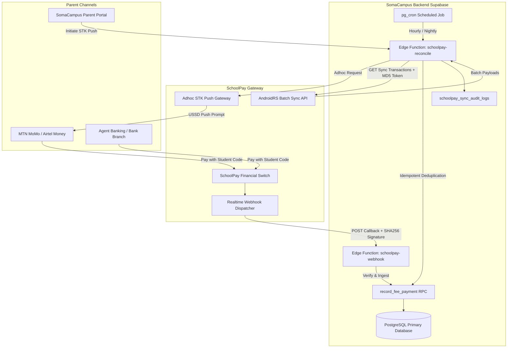
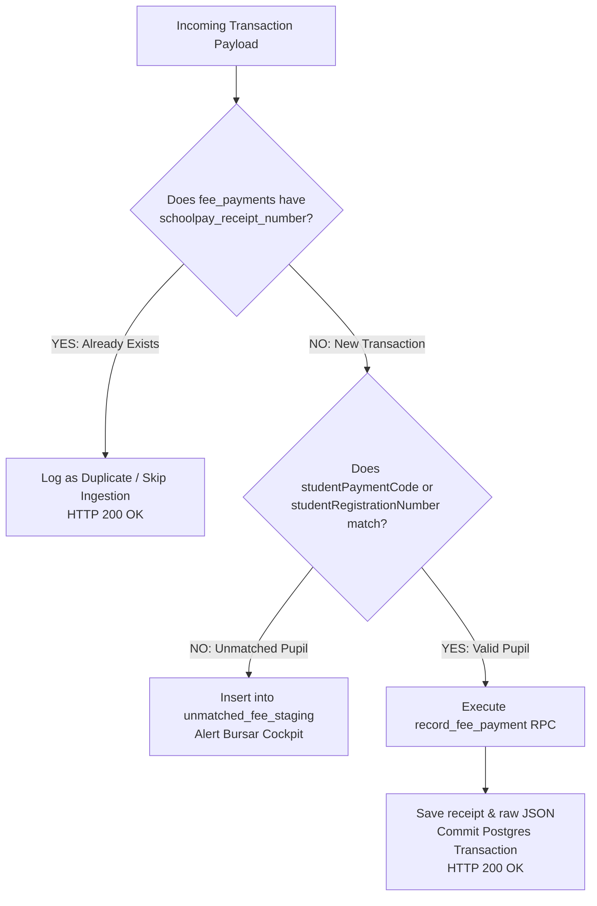
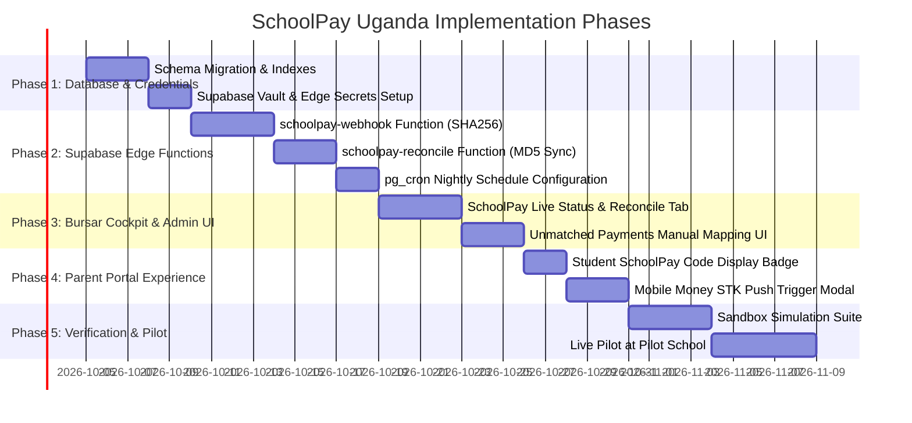

# SchoolPay Uganda Integration Architecture & Roadmap
**Document Version:** 1.0.0  
**Target Milestone:** SomaCampus Finance & Payments v2  
**Status:** Architecture Blueprint / Future Implementation Plan  
**Target Gate:** Production Trust Gate Compliant (Zero In-Memory Cheats, Fail-Closed Security, Server-Side Secrets)

---

## 1. Executive Summary & Business Rationale

In Uganda's education sector, **SchoolPay** (operated by Service Cops Uganda in partnership with commercial banks and telecom operators) is the ubiquitous fee payment aggregation standard. It bridges:
- **Mobile Money Networks**: MTN Mobile Money (`*165#`), Airtel Money (`*185#`).
- **Commercial Bank & Agent Networks**: Stanbic Bank, Centenary Bank, Absa Bank, DFCU Bank, PostBank, Equity Bank, Housing Finance Bank, and nationwide agent banking counters.

### Core Problems Solved
1. **Elimination of Manual Bank Slip Reconciliation**: Currently, bursars must manually inspect paper bank deposit slips or export Excel bank statements to locate `RCP` references, then manually record allocations in SomaCampus.
2. **Instant Payment Confirmation**: Parents receive immediate SMS confirmations, and school fee ledgers update within seconds.
3. **Ghost Receipts & Fraud Prevention**: Bank teller stamps can be falsified; SchoolPay cryptographically verifies every deposit directly at the banking switch.
4. **Parent Convenience**: Parents can pay school fees from home via USSD or initiate an instant STK Push prompt directly to their mobile phone.

---

## 2. Official SchoolPay Uganda API Architecture

Based on the official [SchoolPay Uganda API Documentation](https://www.schoolpay.co.ug/apidocumentation), the integration comprises three core API primitives:



---

## 3. Detailed Endpoint & Cryptographic Specifications

### A. Real-Time Webhook Callback (Instant Notification)
SchoolPay posts transactions to the school's configured callback URL as payments clear the national financial switch.

- **HTTP Method**: `POST`
- **Target URL**: `https://<supabase-project-ref>.functions.supabase.co/schoolpay-webhook`
- **Content-Type**: `application/json` (or `application/x-www-form-urlencoded`)

#### Inbound Payload Schema
```json
{
  "schoolpayReceiptNumber": "SP20260914001928",
  "transactionReference": "UGX-MTN-20260914-918237192",
  "schoolCode": "SCH0042",
  "studentRegistrationNumber": "STU/2026/0014",
  "studentPaymentCode": "1002938471",
  "studentName": "Amari Kyomugisha",
  "amount": 1500000,
  "currency": "UGX",
  "paymentDate": "2026-09-14 14:22:05",
  "sourceChannel": "MTN_MOMO",
  "sourceAccount": "256772123456",
  "payerName": "Florence Kyomugisha",
  "payerPhone": "+256772123456",
  "feeType": "TUITION",
  "signature": "3a8f6e2b1c4d9a7e8f5b2c3d4e5f6a7b8c9d0e1f2a3b4c5d6e7f8a9b0c1d2e3f"
}
```

#### Security & Signature Verification
SchoolPay computes a SHA-256 hex digest over the concatenation of the school's secret API password and the unique `schoolpayReceiptNumber`:
$$\text{Signature} = \text{SHA256}(\text{SCHOOLPAY\_PASSWORD} \parallel \text{schoolpayReceiptNumber})$$

**Fail-Closed Rule**: If the computed signature does not match `payload.signature` via a constant-time comparison, the webhook MUST immediately reject with HTTP `401 Unauthorized` and log a security audit record.

#### Delivery Guarantee & Crucial Caveat
> [!IMPORTANT]
> **SchoolPay does NOT automatically retry failed or timed-out webhooks.**
> If SomaCampus returns HTTP 5xx, or if network latency exceeds SchoolPay's 10-second timeout, the delivery is permanently marked as `FAILED` on SchoolPay's switch.
>
> Therefore:
> 1. The webhook handler must execute quickly (< 800ms).
> 2. SomaCampus **MUST** deploy a Dual-Path Reliability Architecture (Webhook + Scheduled Pull Reconciliation).

---

### B. Sync / Batch Reconciliation API (Pull Gateway)
Used by automated background jobs to pull all transactions for a given date or date range.

#### 1. Daily Sync Endpoint
- **URL**: `https://www.schoolpay.co.ug/AndroidRS/SyncSchoolTransactions`
- **Method**: `GET`
- **Parameters**:
  - `schoolCode`: e.g. `SCH0042`
  - `syncDate`: `YYYY-MM-DD` (e.g. `2026-09-14`)
  - `token`: `MD5(schoolCode + syncDate + password)`

#### 2. Range Sync Endpoint
- **URL**: `https://www.schoolpay.co.ug/AndroidRS/SchoolRangeTransactions`
- **Method**: `GET`
- **Parameters**:
  - `schoolCode`: `SCH0042`
  - `startDate`: `YYYY-MM-DD`
  - `endDate`: `YYYY-MM-DD`
  - `token`: `MD5(schoolCode + startDate + endDate + password)`

#### 3. Supplementary Fees Sync
- **URL**: `https://www.schoolpay.co.ug/AndroidRS/SyncSchoolSupplementaryFeesTransactions`
- **Purpose**: Pulls non-tuition transactions (e.g., educational field trips, swimming gala, uniform store purchases, laboratory fees).

---

### C. Adhoc Request API (Parent STK Push / USSD Prompt)
Allows a parent logged into the SomaCampus Family Portal to initiate an instant USSD push to their phone.

- **URL**: `https://www.schoolpay.co.ug/AndroidRS/AdhocPaymentRequest`
- **Method**: `POST`
- **Payload**:
  ```json
  {
    "schoolCode": "SCH0042",
    "studentCode": "1002938471",
    "amount": 450000,
    "phoneNumber": "256772123456",
    "network": "MTN",
    "narration": "Term 3 2026 Tuition Installment",
    "token": "<MD5_TOKEN>"
  }
  ```
- **Behavior**: The parent's handset lights up with a native SIM toolkit prompt:
  ```text
  Pay UGX 450,000 to SomaCampus St. Jude High School for Amari Kyomugisha?
  Enter Mobile Money PIN:
  ```

---

## 4. SomaCampus Data Mapping & Architectural Fit

### Mapping SchoolPay Payload to PostgreSQL Schema

| SchoolPay Inbound Field | SomaCampus Column / RPC Parameter | Notes |
|---|---|---|
| `schoolCode` | `schools.schoolpay_school_code` | Resolves tenant `p_school_id` UUID |
| `studentPaymentCode` / `studentRegistrationNumber` | `students.schoolpay_payment_code` or `students.student_number` | Resolves `p_student_id` UUID |
| `amount` | `p_amount` (`NUMERIC(14,2)`) | Transacted sum in UGX |
| `paymentDate` | `p_payment_date` (`DATE`) | Truncated to calendar date for ledger |
| `sourceChannel` | `p_payment_channel` | Normalized to `'schoolpay_mtn'`, `'schoolpay_airtel'`, `'schoolpay_bank'` |
| `schoolpayReceiptNumber` | `p_payment_reference` / `fee_payments.schoolpay_receipt_number` | Unique external transaction ID |
| `payerName` | `p_payer_name` | Parent or depositor name |
| `payerPhone` | `p_payer_phone` | Parent MSISDN |
| `feeType` | `p_notes` / `student_charges.fee_category` | Distinguishes regular tuition vs activity fee |

### PostgreSQL Atomic RPC Integration
All incoming SchoolPay transactions (whether from the real-time webhook or the sync reconciliation job) call the existing atomic database function:

```sql
SELECT public.record_fee_payment(
  p_school_id         => v_school_id,
  p_student_id        => v_student_id,
  p_amount            => v_amount,
  p_payment_date      => v_payment_date,
  p_payment_channel   => 'schoolpay_momo',
  p_payment_reference => v_schoolpay_receipt,
  p_payer_name        => v_payer_name,
  p_payer_phone       => v_payer_phone,
  p_notes             => 'SchoolPay receipt: ' || v_schoolpay_receipt || ' (Ref: ' || v_tx_ref || ')'
);
```

#### What `record_fee_payment` Guarantees:
1. **Oldest-Due-First Allocation**: Automatically cascades the payment across open `student_charges` (Term 1 balance $\to$ Term 2 balance $\to$ Term 3 tuition).
2. **Unallocated Overpayment Safety**: If the parent pays more than the total outstanding charges, the remainder is safely preserved in `fee_payments.unallocated_amount` as credit for subsequent terms.
3. **Audit Immutability**: Appends an entry into `financial_audit_logs`.
4. **Zero Dirty States**: Single atomic Postgres transaction; if any constraint fails, the entire write rolls back cleanly.

---

## 5. Schema Extensions (Future Migration Specification)

To support multi-tenant SchoolPay connectivity, the following database migration will be introduced:

```sql
-- Migration: 20261001000001_schoolpay_integration.sql

-- 1. School Tenant Configuration
ALTER TABLE public.schools
  ADD COLUMN IF NOT EXISTS schoolpay_school_code TEXT UNIQUE,
  ADD COLUMN IF NOT EXISTS schoolpay_enabled BOOLEAN NOT NULL DEFAULT false,
  ADD COLUMN IF NOT EXISTS schoolpay_sync_last_run_at TIMESTAMPTZ;

-- 2. Student Payment Code Identification
ALTER TABLE public.students
  ADD COLUMN IF NOT EXISTS schoolpay_payment_code TEXT,
  ADD COLUMN IF NOT EXISTS schoolpay_registered_at TIMESTAMPTZ;

CREATE UNIQUE INDEX IF NOT EXISTS idx_students_schoolpay_code 
  ON public.students (school_id, schoolpay_payment_code) 
  WHERE schoolpay_payment_code IS NOT NULL;

-- 3. Fee Payments External Deduplication Index
ALTER TABLE public.fee_payments
  ADD COLUMN IF NOT EXISTS schoolpay_receipt_number TEXT UNIQUE,
  ADD COLUMN IF NOT EXISTS schoolpay_raw_payload JSONB;

-- 4. SchoolPay Sync & Webhook Audit Log
CREATE TABLE IF NOT EXISTS public.schoolpay_sync_audit_logs (
  id UUID PRIMARY KEY DEFAULT gen_random_uuid(),
  school_id UUID NOT NULL REFERENCES public.schools(id) ON DELETE CASCADE,
  sync_type TEXT NOT NULL CHECK (sync_type IN ('webhook', 'daily_sync', 'range_sync', 'adhoc_push')),
  batch_date DATE,
  transactions_received INT NOT NULL DEFAULT 0,
  transactions_ingested INT NOT NULL DEFAULT 0,
  transactions_skipped_duplicate INT NOT NULL DEFAULT 0,
  transactions_failed_unmatched INT NOT NULL DEFAULT 0,
  error_details JSONB,
  created_at TIMESTAMPTZ NOT NULL DEFAULT now()
);

-- RLS: School finance officers and system administrators can view audit logs
ALTER TABLE public.schoolpay_sync_audit_logs ENABLE ROW LEVEL SECURITY;

CREATE POLICY schoolpay_audit_finance_read ON public.schoolpay_sync_audit_logs
  FOR SELECT
  USING (public.has_school_finance_access(school_id));
```

---

## 6. Idempotency & Deduplication Engine

Because transactions arrive via **both** the instant webhook and the daily sync pull, idempotency is paramount:



### Edge Case Handling
1. **Unmatched Student Code**: If a parent mistakenly enters an old student code or a typo that passed bank validation, the payment is stored in `unmatched_fee_staging` rather than dropped. The Bursar Cockpit flags an amber alert: *"UGX 600,000 received for unknown code #994821 - Click to associate with student"*.
2. **Double Webhook Delivery**: If SchoolPay delivers the same webhook twice due to network delay, `idx_fee_payments_schoolpay_receipt` catches the collision; the second call returns HTTP 200 immediately without double-crediting the student ledger.
3. **Partial Tuition Installments**: Completely supported by `record_fee_payment` waterfall; updates `student_fee_accounts.paid_amount` and marks status as `partial`.

---

## 7. Security Architecture & Server-Side Secrets

Adhering strictly to **SomaCampus Production Trust Gate Rule #3 (Server-Side Data Protection)**:
- **No Client Credentials**: The Vite client application and browser DOM never possess or see the SchoolPay API password or encryption tokens.
- **Supabase Vault / Secret Storage**:
  - `SCHOOLPAY_API_BASE_URL`: `https://www.schoolpay.co.ug`
  - `SCHOOLPAY_SECRET_KEY`: Stored exclusively in Supabase Edge Runtime environment secrets.
- **Service Role Execution**: Edge functions verify signatures with `crypto.subtle` (constant-time comparison) and invoke Postgres RPCs using `SUPABASE_SERVICE_ROLE_KEY`.

---

## 8. Implementation Roadmap & Phases



### Phase Breakdown

#### Phase 1: Database Schema & Tenant Configuration
- Deploy migration `20261001000001_schoolpay_integration.sql`.
- Add `schoolpay_school_code` to pilot school record (`22222222-2222-2222-2222-222222222222`).
- Add `schoolpay_payment_code` generator utility during student admission.

#### Phase 2: Edge Functions & Cron Jobs
- Implement `supabase/functions/schoolpay-webhook/index.ts`:
  - Instant parsing, SHA256 verification, and `record_fee_payment` invocation.
- Implement `supabase/functions/schoolpay-reconcile/index.ts`:
  - Batch queries `AndroidRS/SyncSchoolTransactions`.
  - Loops transactions, verifies against `fee_payments`, idempotently records missing rows.
- Configure `pg_cron` in Supabase:
  - Run `schoolpay-reconcile` daily at `23:30 EAT` and hourly between `08:00 - 18:00 EAT`.

#### Phase 3: Bursar / Finance Admin Cockpit
- Add "SchoolPay Gateway" card to `/fees` page:
  - Shows connectivity status (Online / Sync healthy).
  - Last synced timestamp, total transacted today via SchoolPay (UGX).
  - Manual "Sync Now" button triggering Edge Function for immediate pull.
  - "Unmatched Transactions" review drawer for associating orphan payments.

#### Phase 4: Family Portal Experience
- Display pupil's unique 10-digit SchoolPay code prominently on `/parent/home` fee card with copy-to-clipboard button and instructions:
  - *"Pay via MTN MoMo: `*165#` $\to$ School Fees $\to$ SchoolPay $\to$ Enter Code `1002938471`"*
  - *"Pay via Airtel Money: `*185#` $\to$ School Fees $\to$ SchoolPay $\to$ Enter Code `1002938471`"*
- Add "Pay with Mobile Money (Instant Push)" button triggering adhoc USSD prompt to parent phone.

#### Phase 5: Verification & Sandboxed Testing
- Mock SchoolPay test suite using Vitest:
  - Validates SHA256 signature verification pass/fail.
  - Tests duplicate webhook receipt discard.
  - Tests overpayment allocation waterfall.
  - Verifies zero UI regressions on `/fees` financial truth KPIs.

---

## 9. Conclusion

Integrating SchoolPay Uganda elevates SomaCampus from an administrative record system into an active financial settlement hub. By grounding the architecture in:
1. **A fail-closed dual-path pipeline (Webhook + Scheduled Pull)**,
2. **PostgreSQL atomic transactions (`record_fee_payment`)**, and
3. **Zero-trust server-side cryptography**,

the system will handle millions of shillings in daily tuition payments with guaranteed mathematical truth, zero ghost receipts, and seamless operational ergonomics for Ugandan educators and parents.
