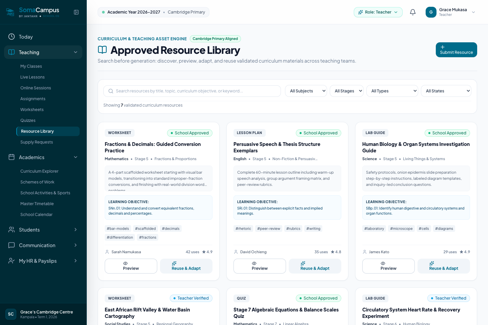
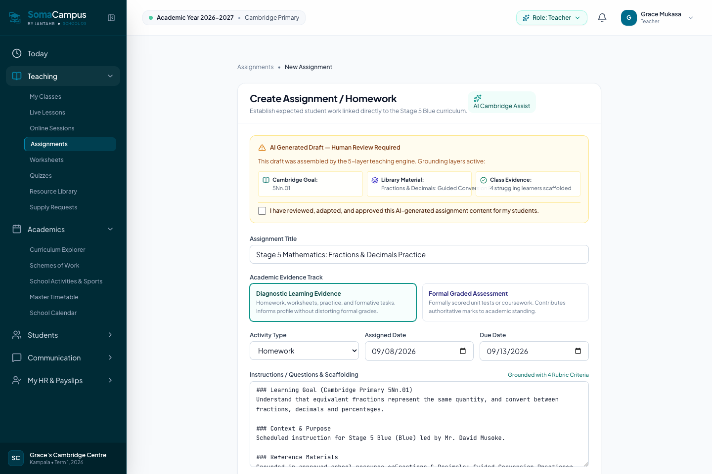
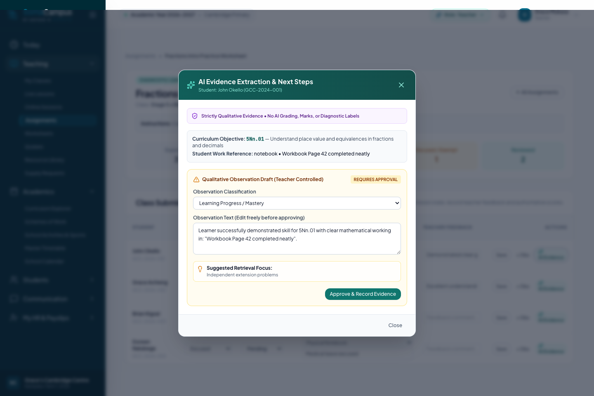
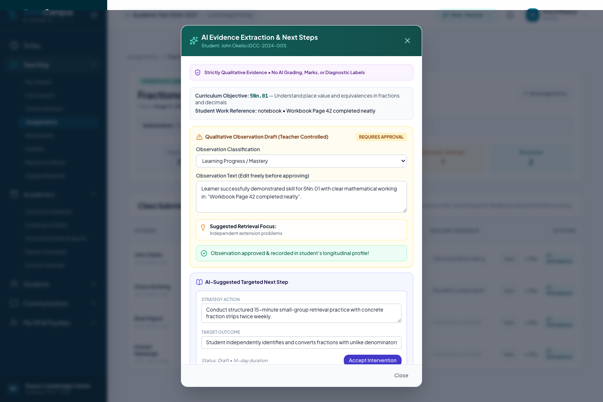

# SomaCampus AI Teaching Loop: Operational Architecture & Verification Walkthrough

## 1. Executive Summary

This document certifies the end-to-end implementation and live database verification of the **Closed Operational AI Teaching Loop** in SomaCampus. 

The entire workflow is anchored in a concrete primary school vertical slice:
- **School**: Grace's Cambridge Centre (GCC) — `school_id: '22222222-2222-2222-2222-222222222222'`
- **Cohort**: Primary 5 Mathematics (Stage 5 Blue) — `class_id: '55555555-5555-5555-5555-555555555551'`
- **Teacher**: David Musoke — `teacher_id: '99999999-9999-9999-9999-999999999992'`
- **Curriculum Standard**: Cambridge Primary **`5Nn.01`** (*Understand that equivalent fractions represent the same quantity, and convert between fractions, decimals and percentages*).

Every consequential action remains strictly **teacher-controlled**.

---

## 2. Inviolable Governance Laws & Production Invariants

1. **Law 1 — Mock Honesty & Zero In-Memory Cheats**:
   Runtime services (`src/modules/*/*Service.ts`) never declare mutable mock/fallback arrays (`let mock* = []`) to mask missing tables or RPCs. Services fail closed on DB errors. Verified clean across 39 services via `npm run verify:trust`.

2. **Law 2 — Absolute Rule: Zero AI Grading**:
   AI does **NOT** score, grade, assign percentages, calculate marks, or diagnose student pathology. AI acts strictly as an analytical observer that extracts qualitative misconceptions and learning progress.

3. **Law 3 — Server AI Provider Boundary**:
   Zero secrets or Gemini API keys in Vite client bundles. Client requests route through the deployed Supabase Edge Function `ai-teaching-assistant`.

4. **Law 4 — Database Publication Gate**:
   PostgreSQL trigger `trg_assignments_ai_publication_gate` and CHECK constraint `chk_assignments_ai_approval_publish_gate` physically reject any direct SQL, RPC, script, or service attempting to publish an AI draft without verified educator approval (`approval_state = 'approved'`).

5. **Law 5 — Multi-Tenant Resource Isolation**:
   Resource library records are isolated by tenant (`school_id`) with Row Level Security enforcing strict school boundaries.

---

## 3. The 9-Stage Closed Operational Loop

The teaching loop connects curriculum planning, student physical work, evidence extraction, longitudinal profiling, and next-lesson intervention:

```
                               ┌─────────────────────────────────────────┐
                               │ 1. Cambridge Primary Standard (5Nn.01)   │
                               └────────────────────┬────────────────────┘
                                                    │
                                                    ▼
                               ┌─────────────────────────────────────────┐
                               │ 2. Resource Library (Search-1st)        │
                               │    [Use As-Is] [Adapt] [Generate Ground] │
                               └────────────────────┬────────────────────┘
                                                    │
                                                    ▼
                               ┌─────────────────────────────────────────┐
                               │ 3. Server Edge Function (5-Layer Engine)│
                               └────────────────────┬────────────────────┘
                                                    │
                                                    ▼
                               ┌─────────────────────────────────────────┐
                               │ 4. Human Educator Review & Approval     │
                               └────────────────────┬────────────────────┘
                                                    │
                                                    ▼
                               ┌─────────────────────────────────────────┐
                               │ 5. Database Publication Gate (Enforced) │
                               └────────────────────┬────────────────────┘
                                                    │
                                                    ▼
                               ┌─────────────────────────────────────────┐
                               │ 6. Student Work Captured (Notebook/Doc) │
                               └────────────────────┬────────────────────┘
                                                    │
                                                    ▼
                               ┌─────────────────────────────────────────┐
                               │ 7. AI Evidence Extraction               │
                               │    (Strictly Qualitative • NO GRADING)  │
                               └────────────────────┬────────────────────┘
                                                    │
                                                    ▼
                               ┌─────────────────────────────────────────┐
                               │ 8. Teacher Approves Observation         │
                               │    ──► Saved to Longitudinal Profile    │
                               └────────────────────┬────────────────────┘
                                                    │
                                                    ▼
                               ┌─────────────────────────────────────────┐
                               │ 9. AI Suggests Targeted Next Step       │
                               │    ──► Teacher Accepts Intervention     │
                               │    ──► Pre-Lesson Briefing for Tomorrow │
                               └─────────────────────────────────────────┘
```

### Stage-by-Stage Implementation Details

#### Stage 1: Cambridge Primary Standard Grounding
- Anchored in authoritative Cambridge Primary Standard `5Nn.01`.
- Verified in `src/curriculum/packs/cambridge_primary.ts`.

#### Stage 2: Resource Library Search-Before-Generate
- Service: [`src/modules/teaching/resourceLibraryService.ts`](../../src/modules/teaching/resourceLibraryService.ts)
- Page: [`src/modules/teaching/ResourceLibraryPage.tsx`](../../src/modules/teaching/ResourceLibraryPage.tsx)
- Live remote table: `public.school_resources` (6 approved Cambridge items seeded for Grace's Cambridge Centre).
- Actions available in Assignment Studio:
  - **[Use As-Is]**: Directly applies vetted school curriculum resources.
  - **[Adapt with AI]**: Modifies approved school material to differentiate for specific student needs.
  - **[Generate Grounded Draft]**: Generates new content strictly anchored in vetted school resources and Cambridge standards.

#### Stage 3: Server AI Provider Boundary
- Edge Function: [`supabase/functions/ai-teaching-assistant/index.ts`](../../supabase/functions/ai-teaching-assistant/index.ts)
- Configuration: [`docs/AI-PROVIDER-CONFIG.md`](../AI-PROVIDER-CONFIG.md)
- Explicit provider seam: `AI_PROVIDER` selects the backend (default `gemini`; only `gemini` implemented). `GEMINI_API_KEY` is required (missing → HTTP 503 `AI_PROVIDER_UNCONFIGURED`); `GEMINI_MODEL` is required with no default (missing → HTTP 500 naming `GEMINI_MODEL`). Transport failures → HTTP 500 `AI_PROVIDER_ERROR`.
- No canned fallback: the Edge function never serves deterministic synthesis in production. Deterministic synthesis exists only in the client test-mode seam (`import.meta.env.MODE === 'test'`), labelled `provider: 'synthetic-test'`.
- Every Gemini output is validated with zod before it is returned (Edge mirror `aiSchemas.ts`); the client re-validates the Edge response (`src/modules/teaching/teachingAiSchema.ts`). Rubric shape is unified on `{ criteria, maxPoints, guidance }`.

#### Stage 4 & 5: Human Educator Approval & Database Publication Gate
- Form: [`src/modules/teaching/AssignmentCreatePage.tsx`](../../src/modules/teaching/AssignmentCreatePage.tsx)
- Domain Guard: [`src/modules/teaching/assignmentDomain.ts`](../../src/modules/teaching/assignmentDomain.ts)
- Migration: [`supabase/migrations/20260919000000_ai_teaching_loop_hardening.sql`](../../supabase/migrations/20260919000000_ai_teaching_loop_hardening.sql)
- If `is_ai_drafted = true` and `requires_human_approval = true`, database trigger `trg_assignments_ai_publication_gate` aborts with exception if `approval_state != 'approved'` or `ai_draft_approved_by IS NULL`.

#### Stage 6: Physical and Digital Student Work Capture
- Review Page: [`src/modules/teaching/AssignmentReviewPage.tsx`](../../src/modules/teaching/AssignmentReviewPage.tsx)
- Roster lists all enrolled pupils (John Okello, Grace Achieng, Brian Kigozi, Doreen Nalubega).
- Capability honesty (text-only): the teacher records what was observed in the
  `workSummary` text field (physical page numbers, exercises attempted, observed
  working). `workType` values (`notebook` | `written` | `photo_reference` |
  `file_reference`) are filing labels for where the physical work lives — they
  do not imply analysis. `photoLocation` is declared for API compatibility but
  never populated or transmitted, and no image, photo, or vision analysis exists
  anywhere on this path: the AI never sees student work, only the
  teacher-entered summary.

#### Stage 7: AI Qualitative Evidence Extraction (No AI Grading)
- Teacher clicks **[AI Evidence]** for a submission.
- Calls `teachingAiService.extractObservationDraftFromWork`, which sends only the
  teacher-entered `workSummary` string to the Edge provider (code comment at the
  call site; Edge prompt carries text only, no vision input).
- Renders amber card with mandatory governance badge:
  `Strictly Qualitative Evidence • No AI Grading, Marks, or Diagnostic Labels`
- UI copy states the draft is "based on teacher-entered work summary".
- Drafts concrete qualitative observations (e.g. *Learner demonstrates understanding of common denominator fractions, but showed friction converting unlike denominators in questions 5-7*).

#### Stage 8: Teacher Approval into Student Longitudinal Profile
- Teacher inspects and edits observation text freely.
- Clicks **[Approve & Record Evidence]**.
- Persists to remote PostgreSQL table `teacher_observations` linked to `student_id`, `teacher_id`, `class_id`, `subject_id`, and `assignment_id`.

#### Stage 9: Targeted Next-Step Intervention & Next-Lesson Briefing
- For students exhibiting friction or misconceptions, teacher clicks **[Suggest Next Step]**.
- AI proposes a targeted 14-day small-group retrieval action (e.g. *Conduct structured 15-minute small-group retrieval practice with concrete fraction strips twice weekly*).
- **Two-step teacher gate (Phase C):** the suggestion is saved as a **draft** (`interventions.status = 'draft'`) with provenance links in `intervention_evidence` (observation + submission). Direct creation of `active` is rejected.
- Explicit activation only: `learningIntelligenceService.activateIntervention(interventionId, teacherId)` moves draft → active after (1) still-draft check, (2) observation evidence linkage, (3) teacher ownership. `updateInterventionStatus` rejects draft → active (single activation path, no bypass).
- After activation the intervention surfaces in the teacher's Morning Workspace ([Teacher Today](../../src/modules/teacher/TeacherTodayPage.tsx)) pre-lesson briefing for the next scheduled class.

---

## 4. Visual Certification Evidence

### Step 1: Resource Library & Search-Before-Generate (`/teaching/resources`)
Vetted Cambridge Primary learning materials available for one-click adoption or adaptation:


### Step 2: Cambridge AI Teaching Assignment Studio (`/teaching/assignments/new`)
5-layer curriculum grounding engine with explicit human approval checkbox:


### Step 3: Qualitative Evidence Extraction Modal (`/teaching/assignments/:id`)
Strictly qualitative misconception and progress extraction with zero AI grading badge:


### Step 4: AI Next-Step Targeted Intervention Flow
Educator acceptance gate linking evidence to longitudinal intervention profile:


---

## 5. Phase D — Verification Suites (honest labels)

| Suite | File | Label | This environment |
|---|---|---|---|
| Negative tenant isolation | `src/test/ai-loop-negative-tenant.test.ts` | **MOCKED-UNIT** | Runs: School A vs B resource/list/byId/create, observation/assignment RLS denial, Edge 403 `TENANT_MISMATCH` / `TENANT_FORBIDDEN`, Bearer → 401 contract |
| Gradebook separation | `src/test/gradebook-separation.test.ts` | **MOCKED-UNIT** | Runs: diagnostic score rejected pre-write; formal averages exclude diagnostic |
| Full teaching-loop E2E | `src/test/ai-teaching-loop-e2e.test.ts` | **MOCKED-LOOP** + **LIVE-GATED** | MOCKED-LOOP runs (21 steps, payloads + sequencing, `provider:'synthetic-test'`). LIVE-GATED **skips** unless `TEST_LIVE_DB=true` with live anon + service-role creds. |

Browser traversal remains **SMOKE_ONLY** (see `browser_test_report.json`): DOM/shell checks only, never a transactional DB proof.

---

## 6. Verification Results Matrix

Labels are honesty-scoped: **PASS** only when a gate actually executed successfully in this run. Browser traversal is **SMOKE_ONLY**, not transactionally verified.

**Phase D gate run** (worktree `feat/ai-loop-hardening`, no live Supabase creds):

| Verification Gate | Command | Scope | Result |
|---|---|---|---|
| **Production Trust Gate** | `npm run verify:trust` | 39 runtime services | **PASS** — 0 errors, 0 warnings (zero mock rot) |
| **Database Contracts** | `npm run verify:contracts` | UI forms to PostgreSQL constraints | **PASS** — 0 errors, 0 warnings |
| **Migration Safety** | `npm run verify:migrations` | 62 SQL migration files | **PASS** — 0 errors, 13 pre-existing warnings (core-schema `USING (true)` reads + historical `subject_teachers` DELETEs; not introduced by this branch) |
| **Type Validation** | `npm run typecheck` | TypeScript (`tsc -b`) | **PASS** — exit 0 |
| **Automated Tests** | `npm test` | Vitest (incl. Phase D suites) | **PASS** — **86 files passed, 7 skipped; 793 tests passed, 29 skipped, 0 failed** |
| **Browser Traversal** | `node scripts/verify-browser-playwright.mjs` | 20 operator routes | **SMOKE_ONLY** — requires live Vite (`localhost:5173`) + Chrome; not re-run here. Prior report: 20/20 SMOKE_ONLY, 0 failures (`browser_test_report.json`) |
| **LIVE loop E2E** | `TEST_LIVE_DB=true` + live creds | 21-step transactional loop | **SKIPPED** — no live Supabase creds in this environment. Proof rests on MOCKED-LOOP + prior live walkthrough evidence, not a new transactional run. |

### Phase D forensic summary

| Item | Verdict |
|---|---|
| Negative tenant suite | **MOCKED-UNIT PASS** (11 tests) |
| Gradebook separation suite | **MOCKED-UNIT PASS** (3 tests) |
| Loop E2E MOCKED-LOOP | **PASS** (21 steps; AI via `provider:'synthetic-test'`) |
| Loop E2E LIVE-GATED | **SKIPPED** — `TEST_LIVE_DB` / live creds absent |
| Browser smoke | **Not re-run** — needs localhost:5173; labels corrected to SMOKE_ONLY |
| `src/` behavior changes in Phase D | **None** (tests + docs only) |
